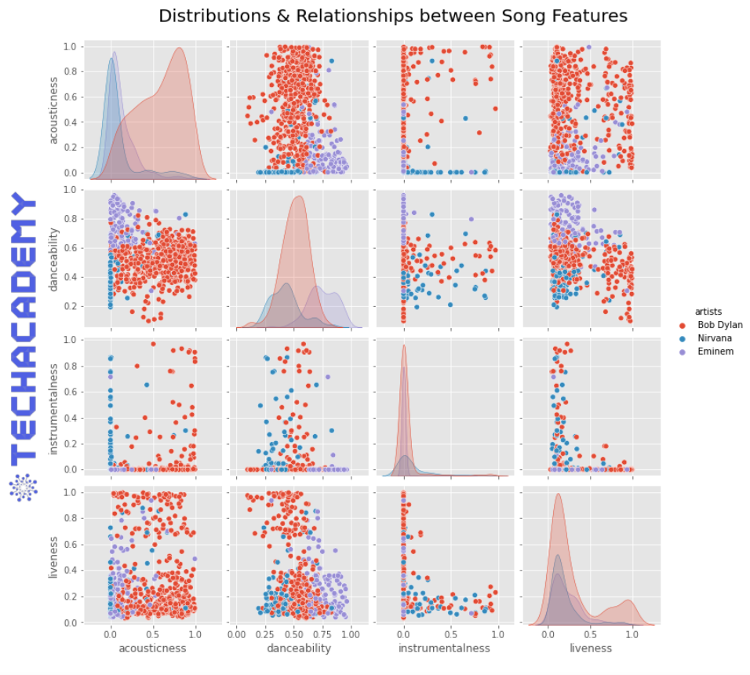

\newpage
# Exploratory Data Analysis
 
At the end of this chapter, you will look into your personal Spotify streaming history. You need to request this data from Spotify, and this can take a few days. Therefore, you should ask for your data as early as possible. Then, start with the first exercises of this chapter which will use some of the data we provide.


**Download your personal Spotify data**

If you do not use Spotify personally, you can skip this step and start with chapter 4.1. 
In chapter 4.5, we will use the requested personal Spotify data, and you can use the data from one of your team members. If nobody on your team uses Spotify, we will provide you with some dummy data.

We will follow eight steps based on [this](https://www.makeuseof.com/tag/download-privacy-data-spotify/) blog post by Dan Price to download your personal Spotify data:

1. Go to https://accounts.spotify.com/en/status and enter your login credentials.
2. In the menu on the screen’s left-hand side, click on Privacy settings.
3. Scroll down to the Download your data section. You will see the following:

```{r, echo=FALSE, message=FALSE, warning=FALSE, fig.align="center", out.width = "100%"}
knitr::include_graphics("splots/spotify.png")
```

4. Click on *Request*. You will probably have to complete a captcha and will receive a confirmation email.
5. Click “Confirm” in the email. This confirmation will take you back to Spotify, where you will receive an on-screen notification saying: “We are preparing your data file. This [process] can take up to 30 days to complete. You’ll receive an email when it is ready to download.” - Spotify
6. When the data preparation is complete, return to Privacy settings; you will now have access to Step 3.
7. Click on Download.

In the next couple of days, you will receive an email from Spotify to download your personal Spotify data as a `my_spotify_data.zip` file. Unzip the file and look for the `StreamingHistory0.json` file.

**Hint**: Check what Spotify knows about you by inspecting `Userdata.json`, `SearchQueries.json`, or `Inferences.json` files using Notepad (Windows), TextEdit (MacOS), or VIM (Linux). Surprised? :)

## Getting Started

In this chapter, you will apply the knowledge that you gained throughout the semester to real-world data. The exercises will cover typical problems that you usually encounter when analyzing data.

Before you can dive into the data, set up your programming environment. This will be the place where the magic happens -- all your coding will take place there.
 
:::: {.tips .r data-latex="r"}
In your workspace on [rstudio.cloud](https://rstudio.cloud/projects), we have already uploaded an “assignment” for you (Template Spotify). When you create a new project within the workspace *Class of ’21 | TechAcademy | Data Science with R*, your workspace will open up. We’ve already made some arrangements for you: The data sets you will be working with throughout the project are already available in your working directory. We also created an ‘RMarkdown’ file, with which you will be able to create a detailed report of your project. You can convert this file into an HTML document when you have completed the documentation. Open the file “Markdown_Spotify.Rmd” and see for yourself!
::::


:::: {.tipsp .python data-latex="p"}
We recommend using [Google Colab](https://colab.research.google.com) for this project since it requires no particular setup, stores its notebooks to your Google Drive, and makes it easy for you to share them with your team members.

As an alternative to Google Colab, you might want to install Jupyter Notebook locally using the Anaconda distribution.
Either way, when importing Spotify data, you can use the links to the respective data files provided in the “Data-Links” document, which you will find in the TechAcademy drive.

We will give you a more detailed step by step demo during the first coding meetup.

::::


### Importing Data

First things first, you will need to load the following two CSV files into your coding environment:

- [spotify_songs.csv](https://drive.google.com/uc?export=download&id=1OmFrdUaPFatpPLRikLJHS-VoF1F27G73)
- [song_features.csv](https://drive.google.com/uc?export=download&id=1gHO566_qxBbz7t8fcH10uVQDAmxK33IF)


How is the data structured, and which variables does it contain? To get a peek at the data you’ll be working with, output the first/last few rows. Also, compute some basic descriptive statistics (count, mean, and standard deviation) and determine the column’s data types.


:::: {.tips .r data-latex="r"}
First, the data set has to be loaded from your folder structure into the workspace. Import both the `song_features.csv` and the `spotify_songs.csv` data sets into your workspace (e.g., using {base} R's `read.csv()`, [{readr}](https://readr.tidyverse.org)'s `read_csv()` or [{data.table}](https://rdatatable.gitlab.io/data.table/)'s `fread()` function) and name the object(s) accordingly. 

Though you can name the object however you wish, we recommend using `original_file_name` + e.g., `_df` (for data.frame) / `_tbl`(for tibble) / `_DT` (for data.table) naming convention, so that you can easily distinguish your R objects (data frames, plots, vectors, etc.) later on.

Now, get an overview of the data set. Are there any variables you could drop while reading the data set? You can use the following functions to print the data frame, for example `head()` or `glimpse()`.

Lastly, get a quick summary of the data using {base} R's `summary()` or [{psych}](https://personality-project.org/r/psych/)'s `describe()` function. 
To find more ways to generate quick data summaries in R, check [this](https://dabblingwithdata.wordpress.com/2018/01/02/my-favourite-r-package-for-summarising-data/) blog post from Adam Medcalf.
::::

:::: {.tipsp .python data-latex="p"}

Start by importing the pandas’ library: `import pandas as pd`.
You can use the same panda’s method you used to import CSV data from your local machine to import CSV data from a web server: Just replace the file path with the URL of the CSV file.

The URLs are: 

- spotify_songs.csv: https://tinyurl.com/TechAcademy-songs
- song_features.csv: https://tinyurl.com/TechAcadey-song-features

Finally, get familiar with the data by outputting some of the data frame (e.g. `df.head()`), as well as some basic information such as column data types and some descriptive statistics (`df.info()` `df.describe()`).
::::

### Convert Milliseconds to Minutes


**We will start with the data set `spotify_songs.csv`.**

You might have noticed a column with song durations given in milliseconds from the task before. Since (presumably) no one measures song durations in milliseconds, convert them into minutes.

:::: {.tips .r data-latex="r"}
You could use [{dplyr}](https://dplyr.tidyverse.org/index.html)'s `mutate` function to compute and add a new column `duration_min` using the existing column `duration_ms`. If you haven't heard of the {dplyr} package yet, take the respective [DataCamp course](https://www.datacamp.com/courses/data-manipulation-with-dplyr) and the DataCamp's course on [Exploratory Data Analysis](https://www.datacamp.com/courses/exploratory-data-analysis). Use the respective function and add the new variable to your existing data set. 

You can use [this](https://www.timecalculator.net/milliseconds-to-minutes) online calculator as a point of reference for the needed `mutate()` calculation.
::::

:::: {.tipsp .python data-latex="p"}

Compute the length of songs in minutes based on the column “duration_ms” and assign it to a new column with

`df[“duration_minutes”]= ...`
::::


### Song Durations

Next, we want to focus on the concept of distribution: 
In this task, you should focus on computing the mean and standard deviation of the duration in minutes and finding the song with the longest duration.
Ideally, the output should be well formatted to something like “The song with the longest duration is `[song] by [artist]`.”

:::: {.tips .r data-latex="r"}
Simply use {base} R's `mean()` function to compute a mean of any column in R. Similarly, R comes with `sd()` function to calculate the standard deviation of a column. You can combine these two functions, e.g., in a {dplyr}'s `summarise()` verb.

Next, find the song with the longest duration (in minutes) using the newly created `duration_min` column. The `filter()` verb from {dplyr} in combination with `max()` function could be helpful in this case. Moreover, you can combine {dplyr}'s `select()` verb with the mentioned `filter()` verb to show: song's duration, its artist(s) and its name.

For example:

|  duration_min|  artist(s)|  song name|
|--:|--:|--:|
|  X.X|  YY|  ZZ|
::::
 
:::: {.tipsp .python data-latex="p"}
Calculating mean and standard deviation should be reasonably easy by applying the mean() and std() function to the corresponding column.

To find the song with the longest duration, you can use pandas `nlargest` function. You can apply it to a data frame df with `df.nlargest(n, column)`, where n is the number of rows to keep and `column` defines in which column you want to find the largest values.
::::

### Visualizing Song Distributions

Visualizing data is essential to facilitate perception and understanding of information: Create a graph to visualize the distribution of song lengths. 


We focus on creating a histogram in the tips section since it’s perhaps the most common approach for plotting distributions. You can, however, choose a different chart type; just make sure that the information you want to display is clear and correct.
However, as in school, always add axis labels when possible.

:::: {.tips .r data-latex="r"}
You can use {base} R's `hist()` function to generate a simple histogram of song duration (in minutes). However, we encourage you to use the more extensive [{ggplot2}](https://ggplot2.tidyverse.org) package. {ggplot2}'s syntax is perhaps a bit harder to learn at the start, but it gives you more plotting benefits over the long run. If you haven't heard of the {ggplot2} package yet, take the respective [DataCamp course](https://www.datacamp.com/courses/data-visualization-with-ggplot2-1). 

You could, e.g. install [{esquisse}](https://github.com/dreamRs/esquisse#esquisse-) package to learn the {ggplot2}'s syntax easier. {esquisse} will provide you a graphical user interface (GUI) inside RStudio to generate {ggplot2} figures. You can then copy/paste the syntax that generated the {ggplot2} figure to your R Markdown file. Awesome, eh?
::::

:::: {.tipsp .python data-latex="p"}
With matplotlibs' `pyplot.hist(...)`, you can plot a histogram in one line of code.

With some more lines of code, you could (and should) add axis labels.
Try adding a title to the histogram, change the color to your preferences, etc.
Maybe you could even delete outliers with methods such as `col1.between()` and `col1.quantile()` - but don’t bother with details early on and leave them to the end in case you have enough time.
::::


```{r, echo=FALSE, message=FALSE, warning=FALSE, fig.align="center", out.width = "100%"}

```


## Time Series Data 

### Visualizing Song Durations over Time


While at the topic of song durations, it might also be interesting to see how the average song length evolved: Choose and plot the chart you think is most appropriate for displaying this type of information.

After plotting, please comment/interpret the graph: Were there any significant increases/decreases in song length over time? If so, what could be the reason?

:::: {.tips .r data-latex="r"}
You first need to prepare the data before visualizing it. Generate the average duration of a song (in minutes) by each year. You already used `summarise()` and `mean()` functions before. Now, you need to generate that same statistic for each year. You can, e.g., use {dplyr}'s `group_by()` verb for this purpose. 

Afterward, use {ggplot2} or {base} R's `plot()` to create a chart.

Please answer open questions in RMarkdown outside the code chunk.
::::


:::: {.tipsp .python data-latex="p"}
There is a pandas method to group your data frame by year. In combination with the `.mean()` method, you can compute the average song length by year in one line of code.

Plot the result with matplotlib.

Please answer open questions in text cells.
::::


```{r, echo=FALSE, message=FALSE, warning=FALSE, fig.align="center", out.width = "100%"}
knitr::include_graphics("splots/durations_over_time.png")
```


### Merge

As a data scientist, you’ll often find yourself working with data sets from different data sources referencing the same object. For example, you might have the song names in one file and the respective song features in a separate file. It would make more sense to just merge the two data sets into one.

Indeed, this is what happened with our data. So, to make life easier for the upcoming tasks, you’ll now need to merge both data sets.
As you might have noticed, there is one column that both data sets share. Find out which column that is and combine the data sets on that column.

:::: {.tips .r data-latex="r"}
You could, e.g., use {dplyr}'s `left_join()` to combine the two data sets (`song_features.csv` and `songs.csv`) side-by-side. 

Take a look at the [“R for Data Science”](https://r4ds.had.co.nz/relational-data.html#understanding-joins) book for an illustration of join types.
::::


:::: {.tipsp .python data-latex="p"}
We want to combine the two data sets `spotify_songs.csv` and `song_features.csv`.
The official documentation of the Pandas library provides a great guide on how to deal with this stuff:
https://pandas.pydata.org/docs/user_guide/merging.html
::::


### Line Plot


Your goal for this task is to plot how `acousticness`, `danceability`, `energy`, `valence`, `speechiness`, and `instrumentalness` changed over time.
 
:::: {.tips .r data-latex="r"}
This task involves three steps: creating a summarized data set, reshaping that data set from wide to long format if you'd like to use {ggplot2} and finally -- plotting it. 

Use the familiar `group_by()` and `summarise()` {dplyr} verbs for the first part of the task. Unlike before, include multiple columns in your data summary. Use the familiar `mean()` function on each column to summarize the data. Save the resulting data summary as a new object.

Use the [{tidyr}](https://tidyr.tidyverse.org)'s `pivot_longer()` for the second part of the task. `pivot_longer()` allows you to transform derived summarized data set from wide to long format by decreasing the number of columns and increasing the number of rows (a.k.a., "lengthening" the data). Such transformation is useful for plotting, e.g., in {ggplot2}.

Use the {ggplot2} to create a line chart of six variables for this task's final step. Alternatively, use the {base} R's `plot()`.
::::

:::: {.tipsp .python data-latex="p"}
Once again, group the entries by year, get the mean values for the respective column for all years and use matplotlibs’ pyplot for plotting.
Don’t forget to add a legend and axis labels to the plot.
::::


```{r, echo=FALSE, message=FALSE, warning=FALSE, fig.align="center", out.width = "100%"}
knitr::include_graphics("splots/features_over_time.png")
```


### Radar Plot (Advanced)


**If you are on an advanced track, do this exercise; otherwise, you can skip it.**

Let’s get a little fancy by displaying the yearly average song feature values through an interactive radar chart (aka spider plot or polar plot). This chart is very favorable in some cases when you try to display more than two dimensions. Here, each column (or dimension) gets its axis, and the dots on each axis are connected, resulting in a polygon shape.

The features you’ll need to plot are: `acousticness`, `danceability`, `energy`, `valence`, `speechiness`, and `instrumentalness`.

:::: {.tips .r data-latex="r"}
Use the [{plotly}](https://plotly.com/r/getting-started/) package to create an interactive Radar/Spider chart of six columns over time. Similar to task 2.3 before, this task will involve summarizing, transforming, and plotting the data.

You are now already experienced in summarizing the data with, e.g., `group_by()` and `summarise()` {dplyr} verbs. Focus on summarizing the six columns.

Afterward, transform the data from wide to long format. You could, e.g., use {tidyr}'s `pivot_longer()` again or {data.table}'s `melt()`. 

Lastly, plot the figure using {plotly}. Use [this](https://plotly.com/r/radar-chart/) resource as a point of reference for a static plot. Then, create an interactive animation using [this](https://plotly.com/r/animations/) resource.
::::


:::: {.tipsp .python data-latex="p"}
Here we work with the visualization library plotly, which is a more sophisticated plotting tool than matplotlib:
` import plotly.express as px `.

Use the already computed data frame with average feature values for each year. Note that after you grouped the data frame, the `year` column automatically has been set to be the index column – reverse that (i.e., “reset” the index).
Then apply the `.melt("year")` method on the data frame and have a look at the result. Before continuing, briefly try to understand what happened.

Done that, you can create the radial plot with the `px.line_polar(...)` method. The documentation (google something like “plotly express radar chart” to find the documentation) tells you which arguments you need (and can) pass to this method:
- Of course, you need to pass some value for the `data_frame` argument. For our purpose, this will be the melted data frame.
- You’ll also need to pass values for the keyword arguments `r`, `theta`, `animation_frame`, `line_close`, and `range_r`.
The values for these arguments are the strings `“value”`, `“variable”`, `“year”`, the boolean value `True`, and the tuple `(0,1)` respectively.

Apply `.show()` directly after the `line_polar(...)` method to display the plot.

As always, try updating font size, layout, etc., as you like.
::::

```{r, echo=FALSE, message=FALSE, warning=FALSE, fig.align="center", out.width = "100%"}
knitr::include_graphics("splots/features_over_time_advanced.png")
```


## Artists

### Most Productive Artists

Our subsequent interest lies in analyzing music artists: Start by showing which artists wrote the most songs using a horizontal bar plot (or any other plot you think works best).
 
:::: {.tips .r data-latex="r"}
You could use the familiar `group_by()` {dplyr} verb for this task. However, it would help if you counted the songs of each artist. Does that ring a bell for another {dplyr} verb? 

After grouping and counting, sort the result by its count. Then, subset the 15 artists with most songs. You can save the derived data summary to a new object.

Lastly, plot the result using {base} R or {ggplot2} by creating a bar chart.
::::

:::: {.tipsp .python data-latex="p"}
Pandas’ `.value_counts(...)` method is all you need to prepare the data.
For plotting use matplotlib’s `plt.barh(...)`.
::::


```{r, echo=FALSE, message=FALSE, warning=FALSE, fig.align="center", out.width = "100%"}
knitr::include_graphics("splots/artists_bar_chart.png")
```


### Charts 


Care to discover new songs?

In this section, you’ll work with entirely new data (links in the respective tips section).
The goal should be to create a map with a hover effect displaying each country’s top song (and its composer) when hovering your mouse over that country.


:::: {.tips .r data-latex="r"}
First, load the data set `weekly_charts.csv` and find each country's top song. You could use the familiar {dplyr} verbs for this part. You could also save the resulting data set for plotting.

Then, use [{highcharter}](https://jkunst.com/highcharter/) to create a simple interactive map. Check [this documentation](https://jkunst.com/highcharter/articles/maps.html) if you'd like to do that. In the case of {highcharter}, you do not need any additional data as the package relies on `ISO Alpha 2` (two-letter) country codes supplied in the `country` column of the `weekly_charts.csv` data set. Make use of {highcharter}'s `hc_tooltip()` function and its `pointFormat` argument for a mouse hover effect.

Alternatively, use {plotly} to create an interactive map. In this case, you have more customization options, but you need to add `ISO Alpha 3` (three-letter) country codes to the `weekly_charts.csv` data set. You can load [this CSV file](https://github.com/lukes/ISO-3166-Countries-with-Regional-Codes/blob/master/all/all.csv) via URL to merge `ISO Alpha 3` country codes with countries in the `weekly_charts.csv` data set. Then, create a plot using {plotly} as described [here](https://plotly.com/r/choropleth-maps/).
::::


:::: {.tipsp .python data-latex="p"}
There exists a library for plotting maps: `import folium`.
With folium, you can easily plot a map by running the following two lines:
```
m = folium.Map(location=[20,10], zoom_start=2)
m
```

Folium requires you to specify each country’s country border coordinates you like to be drawn (i.e., colored, like in our example map). For this, we prepared a JSON file with all that data. Note that this is not a CSV file; hence you can’t use the pandas `.read_csv()` method. You’ll need to work with two new libraries for importing the data - one for requesting the data from a web server (i.e., Google Drive) and one to parse (i.e., read) the data. Here’s the code:
```
import requests
import JSON

# request data from a url
response = requests.get(“https://tinyurl.com/TechAcademy-GeoData”)
# parse json data
geo_data = json.loads(response.content)
```

If you print out the data, you will notice each data subset belongs to a country, and that also contains the top song for the respective country: ```print(geo_data["features"][0])  # prints data of the first country in JSON file```
 
Now, “draw” the country borders by passing the `geo_data` as an argument to `folium.GeoJson(...).add_to(m)`, and assign it to the variable `geo`. Note: there is no other variable that needs to be passed as arguments here.
Having done that, add the hover effect displaying each country’s top song with `geo.add_child(folium.GeoJsonTooltip(...)` and specify fields and aliases through the method’s parameters. There is no need to assign this to a variable. You can look up folium’s `GeoJsonTooltip` class online to understand how are fields and aliases passed as arguments.
Display the map by solely typing the letter `m`.

::::


```{r, echo=FALSE, message=FALSE, warning=FALSE, fig.align="center", out.width = "100%"}
knitr::include_graphics("splots/map.png")
```

## Compare Artists Based on their Songs


### Pairplot of different artists

Until now, we analyzed songs individually or compared how many songs individual artists produced. Now, we want to compare the features of songs from artists with each other. For example, how do songs from “Bob Marley” differ from “Nirvana”.
Search in the data set for three different artists or bands which you like. We would recommend that these artists produce music from various genres to see more significant differences between them.


:::: {.tips .r data-latex="r"}
Pick the three artists of your choice (e.g., "Bob Dylan," "Nirvana," and "Eminem"). You could save your selection to a character vector, e.g., `my_artists_vec`. 

You then need to filter/subset the data set for these three artists. That means finding the rows that contain any of those three artists' names. While doing that, make sure to include the four columns of interest for these artists too. You could use {dplyr}'s `filter()` and `select()` verbs for this purpose.

Afterward, create a pairplot between three artists of your choice. Remember, you are comparing the four features between the three artists. You could use [{GGally}](http://ggobi.github.io/ggally/)'s `ggpairs()` for this purpose. Feel free to play around with the `ggpairs()` function's arguments as described in [its documentation](http://ggobi.github.io/ggally/articles/ggpairs.html)
::::

:::: {.tipsp .python data-latex="p"}
Pick three artists of your choice (e.g., “Bob Dylan”, “Nirvana”, and “Eminem”). Filter the data set so that it contains only songs of these three artists.
Now, you can use the `seaborn` library for visualization. Import this library and use the `pairplot()` function where you pass the filtered data frame as a parameter, and as the `hue` value, you choose “artists”.
::::


```{r, echo=FALSE, message=FALSE, warning=FALSE, fig.align="center", out.width = "100%"}

```


### Discover New Visualization Methods

Python and R can produce insightful visualizations, and in this exercise, we want to give you an impression of what wide range of visualization types are available. Therefore you can have a look at a gallery that shows a wide range of example plots. Choose one of these possible plots and generate such a plot with the Spotify data. 
Write in a comment what your visualization shows and what message it delivers. What insights about the data do you get from this plot?

:::: {.tips .r data-latex="r"}
Visit ["The R Graph Gallery"](https://www.r-graph-gallery.com/all-graphs) to find inspiration for your figure. You could then use either the {base} R or the familiar {ggplot2} package to create the plot of your choice.
::::

:::: {.tipsp .python data-latex="p"}


Visit the ["Seaborn Gallery"] (https://seaborn.pydata.org/examples/index.html#), look for a plot that you could use to visualize an aspect of Spotify data and generate a visualization.
::::

## Analyse Personal Spotify Data

We dived into the provided Spotify data set, and now is the time to look into your personal streaming history. Therefore we use the data set which we requested from Spotify. 
If you do not use Spotify, you can also use data from a member of your team. If nobody on your team uses Spotify, contact your mentor, and we will provide you with some dummy data.
Each year Spotify generates a personal wrap-up of your streaming history. Now, we want to produce something similar. First, we want to look at our favorite artists and afterward into our streaming behavior. On which days do we listen to more music or at which times of the day?
This section only scratches the surface of what is possible after you receive your Spotify data. We will illustrate some ideas on how you can analyze your data. In the end, we will mention how you could expand your analysis.


### Generate Bar Plot with Top 10 artists

We want to start with a Bar plot that shows your favorite artists.
First, we have to load the data into our work environment. If you look at the downloaded data, you can see the `StreamingHistory0.json` JSON file. This file, however, is not a CSV file. But this is not a big problem as you will see.

:::: {.tips .r data-latex="r"}
First of all, you have to upload your data to access it on RStudio Cloud. Check [this](https://community.rstudio.com/t/importing-data-into-r-studio-cloud/14332/5) series of posts on how to do it. Click on the `Files` tab in the right pane of your RStudio dashboard. You will then find the `Upload` button right below the `Packages` button. After uploading your file, you will see it in your RStudio dashboard under the `Files` tab -- ready to be loaded. 

You can use the `fromJSON()` function available in [{jsonlite}](https://cran.r-project.org/package=jsonlite), [{rjson}](https://cran.r-project.org/package=rjson) or [{RJSONIO}](https://cran.r-project.org/package=RJSONIO) package to load the `StreamingHistory0.json` file into your session. This works similar like, e.g., `read_csv()` function that you already used to load a CSV file.

Pick the package whose naming convention comes off most intuitively to you, load the JSON file via `fromJSON()` and save it as a familiar data frame object (e.g., `streaming_history_df`).
::::

:::: {.tipsp .python data-latex="p"}
First of all, you have to upload your data to access it with Google Colab. On the left side, you can find a “Folder” symbol. Click on it, and you can upload your data with drag and drop. The path to your file is then “/content/your_filename.json”.
Until now, we loaded CSV-Files with the pandas method:
``` pd.read_csv(file) ```
So, what pandas method could you use to load JSON files ;) ?

::::

After you loaded the file into your environment, take some time to first look at the data. Print out a couple of rows and look at what columns this data set contains. It could be helpful again to compute a column `minutesPlayed` from the column `msPlayed`.
Afterward, you can create a graph with the artists you listened to the most.

:::: {.tips .r data-latex="r"}
You could add a variable to your personal Spotify data set which counts the number of times you listened to a particular song. Take advantage, e.g., of {dplyr}'s `mutate()` verb. Name the new variable, for example `n_times_song_played`.

Afterward, you could arrange the data set by the newly created `n_times_song_played` variable.

Finally, create a chart of the ten most played artists.
::::

:::: {.tipsp .python data-latex="p"}
Because we want to group the data by the different artists and count how often they appear, the ```df.groupby()``` will be helpful again. 
Afterward, you need to sort the data and can then visualize it in a plot.
::::


### Visualize your Streaming Behavior

We computed and visualized our favorite artists, but when do we listen to music in general? This question is something we want to analyze now. There are different possibilities to explore this question, and we will start by visualizing how many songs you listened to each day with a line plot. Furthermore, you could plot if you listen to more music in the morning, during the day, or in the evening. On which weekday do you listen to more music? More during the week or on the weekend? There are many different ways to explore your data further.

:::: {.tips .r data-latex="r"}
Take advantage of [{lubridate}](https://lubridate.tidyverse.org) package for processing dates and times in R. You can easily extract time information (e.g., year, month, day, hour or minute) from the raw `endTime` column using {lubridate}. 

Then, add the extracted time information back to the data set, e.g., via the `mutate()` verb.

You could then add a song counter column to your data set, e.g., `n_listened_songs_per_day` using the familiar {dplyr} verbs. Make use of the extracted `day` information from the raw `endTime` column while grouping and summarizing the data.

Lastly, create a line chart of your data set using {base} R's `plot()` or {ggplot2} package.
::::

:::: {.tipsp .python data-latex="p"}

First of all, we have to tell pandas that the column “endTime” is a date. This can be done with the ```pd.to_datetime()``` function.
Afterward, you can group the entries by date with the following command:
````df.groupby(by=df[‘endTime’].dt.date```.
You can then, for example, count how many songs you listened to each day or sum up the amount of time you listened to and visualize this with a line plot.
With ````df[‘endTime’].dt.date``` the dt you access the DateTime object, and with .date, you group the data by each date which occurs in the data. But it is also possible to group by day or hour instead of date. 
Try it out and visualize it in a plot.
::::


```{r, echo=FALSE, message=FALSE, warning=FALSE, fig.align="center", out.width = "100%"}

```


Congratulations – based on your work with fundamental data transformations and many visualizations, you now have a solid understanding of the Spotify songs data set as well as your personal streaming history. You have now successfully completed the first part of the project! If you are in the beginner group, you have met your minimum requirements. Nevertheless, we strongly recommend that you also have a look at the following part. There you’ll be developing methods to predict the popularity of songs! Sounds exciting, doesn’t it?


