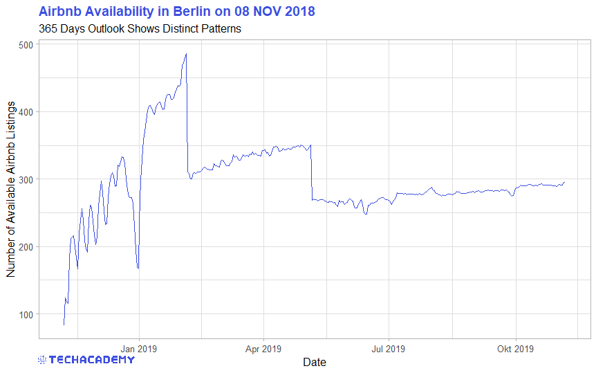
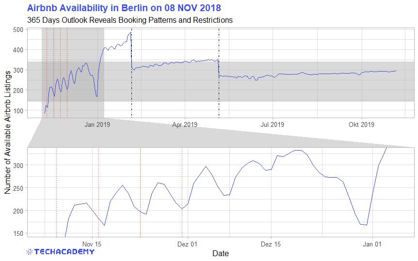
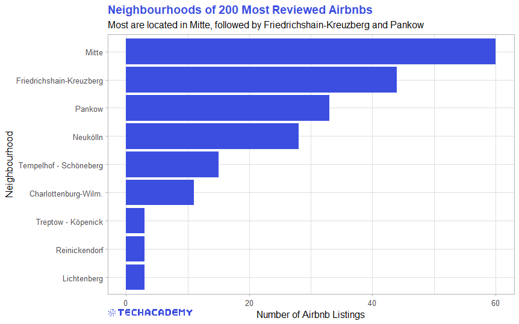
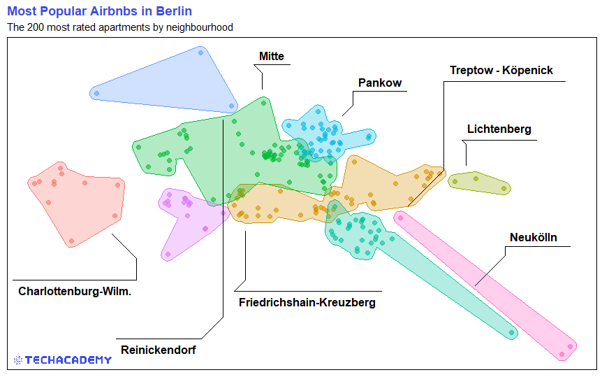
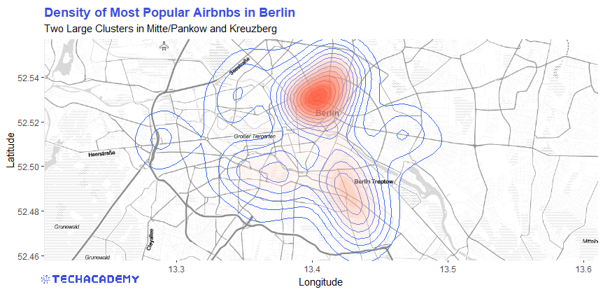

\newpage
# Exploratory Data Analysis
 
Before you can dive into the data, set up your programming environment. This will be the place where the magic happens -- all your coding will take place there.
 
:::: {.tips .r data-latex="r"}
 
In your workspace on [rstudio.cloud](https://rstudio.cloud/projects) we have already uploaded an “assignment” for you (Template Airbnb). When you create a new project within the workspace *Class of ’20/21 | TechAcademy | Data Science with R*, your own workspace will open up. We’ve already made some arrangements for you: The data sets that you will be working with throughout the project are already available in your working directory. We also created an 'RMarkdown' file, with which you will be able to create a detailed report of your project. You can convert this file into a PDF document when you have completed the documentation. Open the file “Markdown_Airbnb.Rmd” and see for yourself!
 
::::

:::: {.tipsp .python data-latex="p"}
We recommend using [Google Colab](https://colab.research.google.com) for this project since it requires no particular setup, stores its notebooks to your Google Drive, and makes it easy for you to share them with your team members.

As an alternative to Google Colab, you might want to install Jupyter Notebook locally using the Anaconda distribution.
Either way, when importing Airbnb data, you can use the links to the respective data files provided in the “Data-Links” document, which you will find in the TechAcademy drive.

We will give you a more detailed step by step demo during the first coding meetup.

::::

## Visualizing Apartment Availability 
### Import, Clean and Transform the Data
 
In this section you will get to apply the basics of working with data: You will import, clean and transform the data so that you will then be able to visualize it in the next step.

:::: {.tips .r data-latex="r"}
First the data set has to be loaded from your folder structure into the workspace. Import the calendar data set into your workspace and name the object accordingly.

`calendar <- read.csv("calendar.csv")`

Now get an overview of the data set. How is it structured and which variables does it contain? You can use the following functions, for example:

`head(calendar)`    
`str(calendar)`   
`summary(calendar)`   

::::

:::: {.tipsp .python data-latex="p"}
 
Import the pandas library to your notebook with `import pandas as pd`. Load the data from your csv-file into a data frame with pandas’ `.read_csv()` function.
 
Have a look at the first rows of your data frame, print some descriptive statistics and get a brief summary of the data with the pandas methods `.head()`, `.describe()` and `.info()`. 
Take note of the data format of the “price” column -- you’ll make use of that information in the next step.
::::


Visualization is one of the most helpful methods to get a feeling for the relation of the various variables of the data set. As already mentioned, this process is called *Exploratory Data Analysis* (EDA).

Before we can start with that, we first have to clean the data such that the functions can process the data set properly. You will have to do that quite often in the field of Data Science, since the data very often comes in an unusable format. In our case, for example, the values in the price column are stored as type `string` -- this becomes an issue when performing math operations.

:::: {.tips .r data-latex="r"}
 In order for `R` to process this, we need to remove a character from the observations and convert the variable into a numeric format. You can use the functions `str_remove_all()` or `gsub()` together with `as.numeric()` for this. 

To make the next step easier, we still have to convert the logical variable `available` from a `character` to a `boolean` data type. Use the `ifelse()` function for this
and replace “f” and “t” with the associated logical values `FALSE` and `TRUE`.

As a last step, transform the date variable into the `R` format `date`. Remember the `as.numeric()` function? `R` has a similar function to convert variables to a date format. 
::::

:::: {.tipsp .python data-latex="p"}
To remove a character in a column’s cells use pandas’ `.replace()` method. Similarly, convert the data to a different type with `.astype()` (Hint: You will need to apply the replace method twice on the price column before converting).

The column indicating if an apartment is available or not contains two types of values - “t” and “f” - which obviously stand for the boolean values True and False. To save you some headaches in the next task convert both values to be of type boolean.

::::


```{r, include=FALSE}
# Preliminaries
library(tidyverse)
library(dplyr)
library(tidyr)
library(ggplot2)
library(maps)
library(countrycode)
library(leaflet)
library(geojsonio)
library(viridis)
library(magick) # for including a .png in plots
TA_logo <- image_read("plots/TA_logo.png")
library(gghighlight)
library(GGally)
library(ggrepel)
```


Our goal now is to show the number of Airbnb apartments that are available over the next year in a simple line plot. This is still not possible, however, since there currently is an entry for each apartment for each of the upcoming 365 days and another related variable that shows us whether the apartment is available or not on each of those days. The transformed data set should summarize this information and should only have one entry for each day that tells us the aggregated number of available Airbnbs in Berlin.


:::: {.tips .r data-latex="r"}
 
The `R` package `dplyr` is the first choice for this type of transformation task. If you haven’t heard of it yet, take the respective DataCamp course and/or the DataCamp course about Exploratory Data Analysis. Use the `dplyr` functions `group_by()` and `summarize()` for this and save the resulting data set in a new data frame, which you can call “avail_by_date”. You can of course name the data frame however you wish. 

If you need further help, you can also use the `dplyr` Cheat Sheet for this task, on which the transformations are visually displayed.


 
::::

:::: {.tipsp .python data-latex="p"}

To sum the numbers of available apartments for each day you first need to filter the data frame by all available apartments. 

Now, understand the next step, remember that you converted the values in the “available” column to be of type `bool` before. In Python, the boolean value True is equal to 1, while False is equal to 0. Thus, (True + True + False) is equal to 2 (try it out: `print(True + True + False)`), and thus, you could now sum the entries in the available column to get the number of available apartments.

So, first group the data frame by date with the `.groupby()`method and use `.sum()` to get the number of available apartments for each date.

The pandas cheat sheet might be of help here - feel free to make use of it.
::::


### 365 Days Lineplot
We have finally transformed the data set into a useful format, so now it is time to actually visualize it. We are going to get started with a simple line plot that shows the number of available apartments over the next 365 days. This is what your result could look like: 

```{r, echo=FALSE, message=FALSE, warning=FALSE, fig.align="center", out.width = "100%"}

```
The following is a more refined example to show you how you can improve a simple line plot to a more complex and informative plot. The attention of the viewer can be brought to certain patterns this way. But don’t get caught up in all the little details, refine your plot to your liking and then move on to the next task. You can always come back to this and play around with the different refinement options. 

```{r availability advanced, echo=FALSE, out.width = '100%'}

```

:::: {.tips .r data-latex="r"}
 
You can use the base package that includes the function `plot()` or you could use the more extensive and very flexible graphics package `ggplot2`. 
 
::::


:::: {.tipsp .python data-latex="p"}

Having the data in the right format we can now start plotting a simple line graph. For this you can use matplotlib’s `plt.plot()`.

::::

Looking at the line plot, you can see a clear pattern with respect to different dates. There are distinct drops in the availability of the Airbnb apartments. **One task for your project is to explain the cause behind this pattern.**


## Visualize individual Airbnb offers with the listings dataset

After looking at the availability over time using the `calendar` data set in the first step, we would now like to find out a little more about the price structure of the available apartments. For this we need the `listings` data set that we can load into the workspace as usual. A closer look reveals that the `price` and `cleaning_fee` columns contain characters and once again need to be cleaned. 

Therefore, as in the first task, the dollar sign as well as the comma must be deleted from these columns. Since you use the same procedure for the `price` and `cleaning_fee` columns, a `for`-loop is recommended here. Implement this loop in a self-written function `clean_price()`, so that you save a lot of lines of code, especially in the prediction part.


:::: {.tips .r data-latex="r"}
There are different ways to create this for-loop, so just experiment with what makes most sense to you. 

But you definitely want to iterate over all values within one column, so your for-loop function should contain 


`for (i in 1:length(column_name))`

where "column_name" only acts as a place holder for the variable you want to work on.  
::::

 
:::: {.tipsp .python data-latex="p"}
Create a list containing the column names of both columns you want to iterate over.

The for-loop body doesn’t necessarily need more than one line and might start like this:

```
for column_name in column_names_list:
    df[column_name] = df[column_name].str.replace(....
```
::::

Now that we have cleaned up the data set, we can take a closer look at the price structure of the various neighborhoods. First of all, we would like to know what the average price and the corresponding standard deviation is for each neighborhood. Make a list with the names of the different parts of the city as well as the `mean` and the `sd`.

:::: {.tips .r data-latex="r"}
For this, you can again use `dplyr`-functions like `group_by()` or `summarize()`.
::::


:::: {.tipsp .python data-latex="p"}

Once again you can use the groupby method to group by neighborhood and apply the aggregation function `.std()` to get the standard deviations. Similarly, you can use `.mean()` to get the mean values. Filter both data frames by the price column.
::::


We now want to compare the price distribution for the on average most expensive district with the on average least expensive district. For this, you have to think about the different types of plots that you have gotten to know in your courses and have to find the plot type that is most suited for this type of visualization. Once you have created the diagram, you will probably have to filter out some of the outliers with extremely high prices in order to get a meaningful plot. 


:::: {.tips .r data-latex="r"}
 
In `ggplot2` graphics, you can easily filter in the plot specifications with `xlim` or `ylim`.
 
::::

:::: {.tipsp .python data-latex="p"}
One way to find the on average most expensive neighborhood is to simply sort the mean price column in descending order. 

For plotting: The Matplotlib documentation is a great source of inspiration with many examples including code that generated them.

::::

On the Airbnb website, the available apartments can be sorted by price and are shown to the customer in the appropriate order. One method to end up higher in this ranking is to quote a low price and a higher cleaning fee. Can we see this behavior in our data set? To figure this out, create an additional column in  your data frame with the name `price_and_clean`, in which you add both individual prices. Now examine how the price distribution changes in the two previously examined parts of the city. Compare the price and price + cleaning fee of a district in a diagram. What do you observe?

## Merging of Listings and Reviewing the Data Set

In the previous part you got to know and visualized the listings data set. However, one important piece of information is not included in this data set: How popular are the individual apartments? We use the number of reviews on Airbnb as a measure of this. This variable could later become very important for price prediction. Fortunately, we have another data set, `reviews`, in which the apartment ID and the date are saved for each individual review. Our goal now is to count the number of reviews for each individual apartment and to save them. Since we can also find the ID in the listings data set, we can use this variable to merge the two data sets. 

First load the new `reviews` data set into your workspace and take a closer look at it with the familiar functions. Now count the number of reviews per apartment.


:::: {.tips .r data-latex="r"}
 
This works with the `table()` function or with `group_by()` and `summarize()`. Note, however, that you still have to convert the result of the `table()` function into a `data.frame` format for further processing.

:::: 

:::: {.tipsp .python data-latex="p"}
 
Count the number of reviews per apartament (i.e. per “listing_id”) with the functions you’re already familiar with at this point. You can use the groupby argument `as_index=False` to avoid setting the column id as index.
::::

Now look at the new data set. Does each ID have exactly one entry with the number of ratings?

To be able to merge the data sets, you have to rename the newly generated variables in the new data set. Name the apartment ID analogous to the `listings` data set `id`, as well as the number of reviews `n_reviews`. 

:::: {.tips .r data-latex="r"}
 
This can be done with the function `rename()` from the `dplyr` package.

:::: 

:::: {.tipsp .python data-latex="p"}
Assign the new column names as a list to the `.column` attribute.
::::

If your data set looks like this, you can merge it with listings:


```{r, echo=FALSE, message=FALSE, warning=FALSE, fig.align="center", out.width = "40%"}
knitr::include_graphics("plot/2_merging_table.png")
```

:::: {.tips .r data-latex="r"}
 
You can use the following structure for merging: 

`listings_reviews <- merge(dataset1, dataset2, by = ...)`

:::: 


:::: {.tipsp .python data-latex="p"}
Merge with `listings_reviews=pd.merge(dataframe1,dataframe2,left_on=...`.
::::


Take a look at the new data set. Is the new variable `n_reviews` in the correct data format? 

### Your First Barplot 

We now want to take a closer look at a smaller part of the data set: What do the most popular apartments have in common? As an indicator of the popularity of an offer we use the previously generated number of reviews `n_reviews`.

Extract the 200 most reviewed apartments. One approach for this is to first sort the data set in descending order according to `n_reviews` and then to extract the first 200 entries into a new data set.

Now you can easily visualize the districts in which the 200 most frequently reviewed apartments are located. A bar plot is ideal for this. Feel free to try other types of plots that can be used to best answer this question.


This is what it could look like: 

```{r, echo=FALSE, message=FALSE, warning=FALSE, fig.align="center", out.width = "100%"}

```


:::: {.tips .r data-latex="r"}
The key commands that you can use for this within `ggplot()` are `geom_bar()` and `coord_flip()`. 
:::: 


:::: {.tipsp .python data-latex="p"}
You can plot bar plots with both pandas and matplotlib.
If you chose to plot with matplotlib, you could use the `plt.barh()` method. Additionally you might want to use methods like `.set_yticks()`, `.set_yticklabels()` and `.invert_yaxis()`.

If Python throws you an `AttributeError`, then try working with the `plt.gca()` method.
::::


## Visualization with Maps

This part will be the final and most advanced part of the EDA -- but also the most rewarding. Anyone who knows the Airbnb website has probably also seen their map showing the locations of all apartments. We can do the same! The only difference is that our data gives us even more options to show what really interests us! 

To reduce complexity, use the smaller data set filtered in the third task with the 200 most frequently reviewed apartments for this task.

We can then place actual objects on the map. Plot the 200 top rated listings on the map. If you have not solved task 3 yet, simply select 200 listings according to other criteria or at random to solve the task. It could look like this: 

```{r, echo=FALSE, message=FALSE, warning=FALSE, fig.align="center", out.width = "100%"}
knitr::include_graphics("plot/4_1_map_top200_simple.png")
```


:::: {.tips .r data-latex="r"}
There are different ways of creating a map with `R`, but the following tips will be about the `ggmap` package. 

Before you can download map material via an API interface, you have to define the corners of the map as coordinates.

First define the height and width of the included coordinates. In the next step you can use this to define the exact corners relative to the coordinates in the data set.
```
height <- max(...) - min(...)
width <- max(...) - min(...)
```
You can then define a vector, which you can call `berlin_borders`, for example. It is used to define the values for the edges of the map. You can add a small safety margin to the respective minima or maxima of the coordinates. Play around with the factors later to find a good section of the map. 
```
berlin_borders <- c(bottom = min(listing_top200$latitude) - 0.1 * height,
top = max(listing_top200$latitude) + 0.1 * height,
left = min(listing_top200$longitude) - 0.1 * width,
right = max(listing_top200$longitude) + 0.1 * width)
```

Then we download the defined map section from the service provider Stamen Maps with the `get_stamenmap()` function and save it in an object.

:::: 


:::: {.tipsp .python data-latex="p"}

We are going to use yet another library, this one is called Folium. For this task you will need to work with its documentation which you can find online.

Make sure the folium package is installed: You can install it directly from within your notebook by executing `!pip install folium`.

Use folium’s `Circle` to draw a circle for each apartment at its location coordinates. You will need to use a for-loop to iterate over all 200 apartments.


```
# Initiate the map
m = folium.Map(
    location=[52.5, 13.4],
    tiles='Stamen Toner',
    zoom_start=11
)

# Use a for-loop to plot circles
for lat, long in ... :
    # Your code here

m  # Displays the map
```
::::


In addition to the coordinates, there is a lot of information about each listing in our data. This time plot the apartments in different colors. 

Use the city districts as a distinguishing feature (also to easily see whether the district assignment actually works). It is sufficient if you implement the same plot as before, only with different colors. However, this is an example of how a more advanced plot can look like: 


```{r, echo=FALSE, message=FALSE, warning=FALSE, fig.align="center", out.width = "100%"}

```


:::: {.tips .r data-latex="r"}
This plot was created with `ggmaps` and the additional package `concaveman` and its function `geom_mark_hull()`, which draws polygons around a cluster of coordinates.
:::: 

:::: {.tipsp .python data-latex="p"}
The plot shown has been created in `R`. In `Python` you’ll simply color the dots differently for each neighborhood.

The obvious solution for this task would be to filter the data frame by a neighborhood and to create a for loop plotting the circles for that specific neighborhood. Then, repeat this process for all the other neighborhoods using different colors.

This approach would lead to repeating (and thus, bad looking) code: Can you find a better way?
::::


For some analyzes it is easier if you don't just see points, but their distributions on a map. For example, to see where there are many apartments in a small space, you can display the apartment density. It could look like this: 


```{r, echo=FALSE, message=FALSE, warning=FALSE, fig.align="center", out.width = "100%"}

```


:::: {.tips .r data-latex="r"}
To create such a two-dimensional density plot you can use the `geom_density2d()` and `stat_density2d()` packages on the map. If you don't know exactly how the individual arguments should be filled, you can always google for more help. 
:::: 


:::: {.tipsp .python data-latex="p"}
No hints or tips here - it’s up to you to study the documentation for folium's Heatmap and to come up with a (possibly) nice heatmap ;)
::::


Congratulations -- based on your work with basic data transformations and many visualizations, you now have a solid understanding of the Airbnb offers in Berlin. With this, you have now successfully completed the first part of the project! If you are in the beginner group, your minimum requirements are hereby met. Nevertheless, we strongly recommend that you also have a look at the following part. There you’ll be developing methods to predict the price of an apartment! Sounds exciting, doesn't it?

