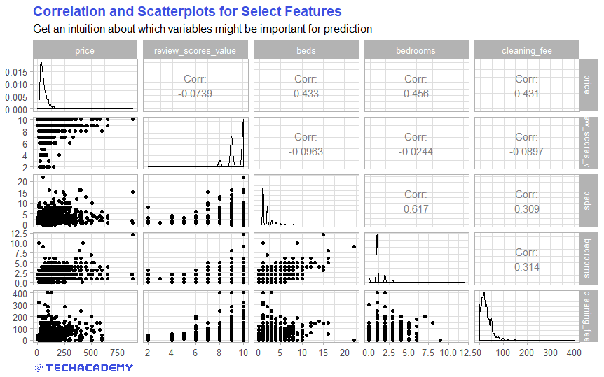
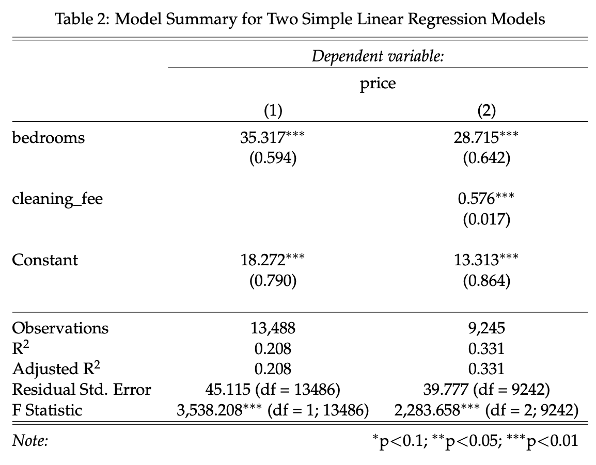

\newpage
# Price Prediction -- Application of Statistical Methods

In the previous part you got a feel for the data set. You now know which variables are included and a few characteristic properties of the data set. But so far, we have only visualized the data set. In this section we go a step further and use statistical methods to predict the price of individual Airbnb apartments as accurately as possible.

In order to be able to compare your models at the end, we use a uniform metric according to which we can check the price predictions for accuracy. In our case this is the Root Mean Square Error ($RMSE$), i.e. the root of the average squared difference between the predicted ($\hat{y}_i$) and actual value ($y_i$):


$$ RMSE = \sqrt{\frac{1}{N}\sum_{i=1}^{N}{(\hat{y}_i-y_i)^2}} $$

The closer the $RMSE$ is to 0, the better your model predicts prices. In the following, your goal is therefore to reduce the $RMSE$ of your various models as much as possible through continuous improvements.

We use three different data sets for the following part, which you can find in the subfolder *Full Data Set*. These are based on a much more extensive data set that contains a total of 96 variables for each apartment. We have already done the test / train / validation split of the data so that each group works with the same data sets.

Here is a brief description of what you need each of the data sets for:

* *train.csv* (60 \%): You use this training data set to train your model. The model can learn the relationships between the variables based on the training data set that contains both, the variables needed to predict the prices and also the actual prices themselves. 

* *test.csv* (30 \%):  With this test data set you can test how well your model predicts the price using data that has not been seen before. This will help you for example with recognizing under- or overfitting.

* *val.csv* (10 \%): We have removed the `price` variable in this validation data set. At the end you apply your best model to it and send us your predictions for the variable `price`. 

We then compare these with the actual values (only known to us) with the help of the $RMSE$ and will then choose the best model across all groups.


Note that some adjustments are necessary in these three data sets. For example, all price variables are marked with a $ sign. As before, we need to remove these in order to be able to transform the values to a numeric format. Always keep in mind that you have to apply all transformations to all three data sets, otherwise you will not be able to apply your trained model to the test and validation data sets.


## Examine the Correlation Between the Variables (train)

First load the `train.csv` data set from the *Full Data Set* folder into your workspace. Now look at the variable names and the first entries to decide which variables could be useful for predicting the price. Select these (limit yourself to no more than 20 variables at first) plus `price` and save it in a new data frame. 

How are the individual variables related to each other? In other words, to what extent do the variables in the data set correlate with one another? Finding this out is extremely important for deciding which model specification to use later. A good place to start is to create a correlation matrix:


```{r, echo=FALSE, message=FALSE, warning=FALSE, fig.align="center", out.width = "100%"}

```

:::: {.tips .r data-latex="r"}
Part of that is function `cor()` from the base package. Select all numerical variables in your data set with the help of `sapply()` and create a correlation matrix. 

The `GGally` package with the `ggpairs()` function provides a very practical plot for visualizing relationships between many variables. 

Select the four variables (and `price`) that you think most influence the price and create a `ggpairs` plot. Note that the plot quickly becomes illegible and takes a long time to create as soon as you plot significantly more than five variables.
::::


:::: {.tipsp .python data-latex="p"}
A handy library for plotting correlation matrices is the seaborn library: `import seaborn as sns`.


Use its pairplot method and pass on the dataframe with the selected columns to visualize distributions and correlations. 


Additionally, you may want to plot a heatmap with `sns.heatmap()` which makes it even easier to see correlations.
::::


Which of your examined variables correlates most with price and which seems to be more independent from price? You now have a first impression over which variables could be important for your model. So let's get to your first price prediction model!

## First Predictions with Simple Regression Models (train)

Now you can make use of your statistical knowledge. You will need a method with which you can predict the price of an Airbnb apartment for a specific day. A very simple first approach would be to use the average demand as the first prediction. However, this is almost certainly not the best prediction. In this case, your predicted price would be the same over all days and would ignore all factors that influence the price.

Ever heard of linear regression? That would be a much better approach. Now you can use your statistics skills. First set up a model with the dependent variable `price`. In the previous exercise you examined different variables. Now choose the variable with the highest correlation to price and use that as the only independent variable.

For example, your first regression model could look like this:


  $$price_i = \beta_0 + \beta_1 bedrooms_i + \epsilon_i$$

 
 


:::: {.tips .r data-latex="r"}
In `R` you can implement a simple linear regression with the function `lm()`. You then get the model summary with the `summary()` function.
::::

:::: {.tipsp .python data-latex="p"}
Define both dependent (y_train) and independent (X_train) variables and clean the data if necessary. 
 
For the next step the X_train values need to be reshaped `.values.reshape(-1,1)`.
Note: If you use more then one feature you don’t have to reshape your data.
 
Import `LinearRegression()` from `sklear.linear_model` and train your model using `LinearRegression().fit()`.
::::

Does your independent variable have a statistically significant impact on apartment price? Probably yes, because we selected the variable most correlated with price. However, if we stick to this very simplified model, we are making a typical mistake: the so-called Omitted Variable Bias (OVB). To put it simply, we neglect (in statistics jargon: “do not control for”) variables that have a significant influence on the dependent variable. One could suspect that other influencing factors also play a large role in price setting. If we do not include them, the estimate of the effect of `bedrooms`is biased and thus hardly useful. In our case this is not a big problem for the time being, since we are not interested in causal effects, but rather in the best possible prediction. Your statistics professor would almost certainly object to such a model. Nonetheless, with just a single explanatory variable, this model will not necessarily predict the price well.

One possible solution is to simply include the omitted variables in the model -- how practical that these are already included in the data set. So let's set up a somewhat more extensive model that includes one more variable:


 $$price_i = \beta_0 + \beta_1 bedrooms_i + \beta_2 cleaning\_fee_i + \epsilon_i$$

 
 
 
 
Now compare the results of the two models. Does the larger model explain a higher proportion of the variance in price? In other words, which model shows the higher value for the $R^2$ measure?


:::: {.tips .r data-latex="r"}
You can easily include such LaTeX tables in your RMarkdown document with the `stargazer` package: 

```{r, echo=FALSE, message=FALSE, warning=FALSE, fig.align="center", out.width = "100%"}

```

::::

## From Training to Testing -- Making Predictions
You have now trained your first model with the training data set. But how well does the model handle data that it has not seen yet? This is a very important test to evaluate the quality of your model.

Has your model only "memorized" the existing patterns in the training data set?
Then the relationships from the training data set would not be transferable to the test data set. With so-called overfitting, the model was trained too closely to the training data set and therefore provides poor predictions for unknown data -- for example the data in your test and validation data sets.

On the other hand, there is also the problem of underfitting: Your model has not sufficiently learned the actual relationships between the data and therefore makes poor predictions in the test data set. So it is important to find a balance between the two problems.

Now the distinction between training and test data sets becomes important. As a reminder: we use train data to train a model and the test data to ultimately test the quality of our model.

Now load the data set `test` in addition to the data set `train` that you have already used. In order to test your model on previously unseen data, you can apply the model to the test data set. 


:::: {.tips .r data-latex="r"}
Use the `predict` function for this:

`predicted_price <- predict(your_saved_model, your_test_data_frame)`

You have now created a vector with all price predictions for the test data set. You can now compare this with the actual values for `price` from `test`.

In order to use a uniform comparison metric, please use the following function to measure your prediction accuracy:


```
# Function that returns Root Mean Squared Error while ignoring NAs
rmse <- function(actual, predicted) {
sqrt(mean((predicted - actual)^2, na.rm = TRUE))
}
```
::::


:::: {.tipsp .python data-latex="p"}
After training, import the data from the `test.csv` file, define both variables `X_test`and `y_test`, and create a vector with price predictions applying `.predict(X_test)` on your model. Store your prediction in the variable `predicted_price`.
 
Finally, compare your predicted values with the test values:
```
from sklearn.metrics import mean_squared_error
# Function that returns Root Mean Squared Error while ignoring NaNs
rmse = mean_squared_error(y_test, predicted_price, squared=False)
```
::::

Now compare both regression models. Does the larger model have better prediction accuracy, i.e. a lower $RMSE$? Now you have a benchmark for your more advanced models, which you can beat in the next part.

## Apply Advanced Machine Learning Algorithms

Now that you have created and tested an initial prediction using a simple regression model, you can now apply more advanced methods. The goal is still to get the lowest possible $RMSE$ when applying the model to the test data set. Now look at at least one other algorithm and then see if that gives you a more accurate prediction (expressed as a lower $RMSE$). You can find inspiration for this in the advanced DataCamp courses, which are listed at the beginning of the project guide. There are no limits for you -- you can refine the regression using certain methods (e.g. LASSO) or set up a random forest model or a neural network. It is usually a good idea to briefly recall the functionality of the respective algorithms and to consider whether this methodology makes sense in this case with a continuous prediction variable.

At this point, a disclaimer is appropriate: Our data set has a substantial part of missing observations (`NA`) for many variables. Some machine learning algorithms require a complete set of data with no missing values, while others can do well with a smaller number. If you get into trouble about the missing values, check whether you can impute the missing values. Which method is best for imputation depends heavily on your prediction algorithm.

You can also get a noticeable gain in predictive power by modifying existing variables or generating new variables from the data set (“feature engineering”). For example, we could imagine that the distance from an apartment to the city center has a significant impact on the price. However, this variable is not
included in our data set. You can write a simple function that uses the two coordinate variables to calculate the distance to the center of Berlin and appends this to the data set as a new variable. 

Always compare the $RMSE$ of your advanced models with each other, as well as with the benchmark regression model from before.

Did you find your best model? Then predict prices with your winning model as above -- but this time on the validation data set `val.csv`.

Attach a `.csv` dataset in the following format with only the two variables `id` and `predicted_price` as an attachment to your project submission. 


:::: {.tips .r data-latex="r"}
You can do this by adding the two vectors `id` and `predicted_price` together and saving them as a `.csv` file. 
```
submission <- cbind(val$id, predicted_price_val)
write.csv(submission, "submission_<<TEAM NAME>>.csv", row.names=FALSE)
```
::::

:::: {.tipsp .python data-latex="p"}
You may need to do some mapping operations between the train.csv data and the predictions to get to the data frame with id and predicted prices.
 
Similarly as with the `pd.read_csv(path/to/file.csv)` method to load data, you can also write data with the `df.to_csv(file.csv)` method.
::::


Congratulations! You’ve made it to the end of your TechAcademy Data Science project. After visualizing the data in the first part, you’ve also set up predictive models in this section. If you stuck around until this part and managed to code the better part of the exercises, you’ve definitely earned your certificate! We hope you had fun learning Data Science with this data set and you enjoyed it – at least the parts where you didn’t get stuck forever because of some unexplainable coding error. Don't forget to send your project results and the prediction-csv file you just generated to our project submission email address before the deadline.


